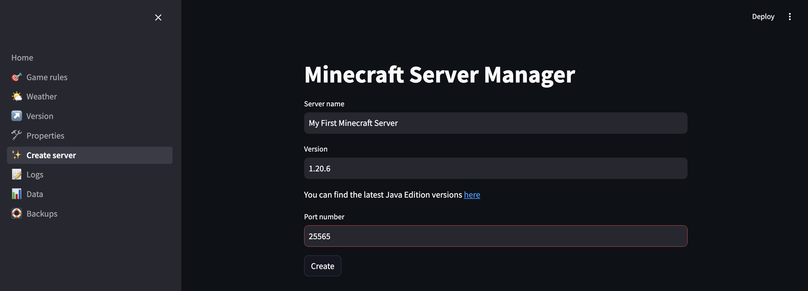

# Minecraft Server Manager

This is a Minecraft **Java Edition** server manager built using Streamlit.

The goal of this project is to provide a simple web interface that my kids
can use to manage Minecraft servers. The interface is deliberately simple, and
allows kids to easily:

- Create servers
- Start & stop servers
- Change settings
- Create backups

## Setup

Create a virtual environment, install requirements and create empty settings
file with:

```bash
pip install invoke
invoke setup
```

Activate the environment and install requirements:

```bash
source venv/bin/activate
```

Update the `settings.ini` config with JAVA_HOME.

## Running the Streamlit server

This section covers how to launch the Streamlit web interface. Note that
this won't result in a running Minecraft server, but once the Streamlit app
is running you can create and manage Minecraft servers.

### Run the streamlit in the foreground (for development)

Run locally with:

```bash
invoke run
```

### Run the Streamlit app in the background

Run in the background with:

```bash
./start.sh
```

Console output will be written to `nohup.out` in the project directory, and
the server PID will be written to `streamlit_server.pid`.

Check the status of the server with:

```bash
./status.sh
```

Stop the Streamlit server with:

```
./stop.sh
```

Note that this will stop the Streamlit web interface, but it won't change the
status of any running Minecraft servers.

## Creating a Minecraft server

When the app is first launched you will be presented with the Home screen. Here you can
select a server to manage, however on first launch there will be no servers available.


Select **Create server** from the side menu, and provide details for the server, then
click the **Create** button.



This will run for a few moments, then you should see a success message:


Navigating back to the **Home** screen, you will see the server is running, and you
will see the server log file:


From this screen you can stop and restart the Minecrat server. You can also issue
commands:


## Updating server properties

You can change server properties using the **Properties** menu. After making a change to
the server properties (when the **Save** button is pressed) the Minecraft server will restart.


## Upgrading the Minecraft server

When a new version of Minecraft Java Edition is released the game clients will
often update to the new version immediately. This can result in frustrated little
ones as they try to connect. Upgrading to a new version is as easy as navigating
to the **Version** menu, and entering the new Minecraft version.


WHen you press **Enter** behind the scenes the following steps happen:

- Download the server jar file to the `downloads` directory
- Shut down the Minecraft server
- Backup the server
- Upgrade the server jar file
- Start the server

## Deleting a Minecraft server

No provision is made to delete minecraft server. This is deliberate, with
the intention to make it difficult to accidentally delete a server.

In order to manually delete a server, first stop the Minecraft server.

Next, locate the server directory in the `servers/` directory. You can
delete the server directory, which will remove the server, all configuration,
and any worlds on the server. Use caution!!